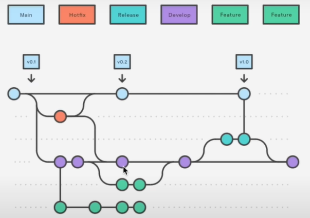

- [Learn Git and GitHub](#learn-git-and-github)
  - [Comandos de terminal](#comandos-de-terminal)
  - [Configuracion de Git](#configuracion-de-git)
    - [***--global***](#--global)
  - [Git init](#git-init)
  - [Ramas](#ramas)
  - [Git add y git commit](#git-add-y-git-commit)
    - [Tomar la fotografia](#tomar-la-fotografia)
  - [Como ver si se a realizado esta fotografia?](#como-ver-si-se-a-realizado-esta-fotografia)
  - [Como regresar en el tiempo](#como-regresar-en-el-tiempo)
  - [.gitignore](#gitignore)
  - [Ver cambios en documentos.](#ver-cambios-en-documentos)
  - [Moverse en el tiempo](#moverse-en-el-tiempo)
  - [git reset --hard y git reflog](#git-reset---hard-y-git-reflog)
    - [(Buscar informacion sobre revert)](#buscar-informacion-sobre-revert)
  - [git tag](#git-tag)
  - [git branch y git switch](#git-branch-y-git-switch)
  - [git merge](#git-merge)
  - [Conflictos](#conflictos)
  - [git stash](#git-stash)
  - [Reintegracion de ramas](#reintegracion-de-ramas)
  - [Eliminacion de ramas](#eliminacion-de-ramas)
  - [GitHub](#github)
  - [Repositorio Personal](#repositorio-personal)
  - [Autenticacion SSH](#autenticacion-ssh)
  - [Git remote](#git-remote)
  - [Subida/Actualizar de un proyecto a github](#subidaactualizar-de-un-proyecto-a-github)
  - [Git fetch y git pull](#git-fetch-y-git-pull)
- [Git clone](#git-clone)
  - ["fork"](#fork)
  - [Flujo colaborativo - pull request (PR)](#flujo-colaborativo---pull-request-pr)
  - [Resolucion de conflictos en las PR](#resolucion-de-conflictos-en-las-pr)
  - [Markdown en GitHub](#markdown-en-github)
  - [Herramientas graficas](#herramientas-graficas)
  - [Git y GitHub "flow"](#git-y-github-flow)
  - ["git cherry-pick" y "git rebase"](#git-cherry-pick-y-git-rebase)
    - [**git cherry-pick**](#git-cherry-pick)
    - [**git rebase**](#git-rebase)
  - [GitHub pages y Actions](#github-pages-y-actions)

# Learn Git and GitHub

[Primeros pasos con Git y GitHub](https://training.github.com/downloads/es_ES/github-git-cheat-sheet.pdf)

Ver version de Git:

`git --version` **or** `git -v`

## Comandos de terminal
---

|         Comando         | Explicacion            | Ejemplo               |
| :---------------------: | ---------------------- | --------------------- |
|           cd            | Moverse entre archivos | `cd ..`               |
|           pwd           | Ver ruta actual        | `pwd`                 |
|          mkdir          | Hacer una carpeta      | `mkdir 'nombre'`      |
| echo content > name.ext | crear un archivo       | `echo None > main.py` |

## Configuracion de Git
---

[Manual en linea](https://git-scm.com/docs 'https://git-scm.com/docs')

Principalmente se esscribe `git config` en la termnial y a apartir de esta usamos:

### ***--global***

configuracion global a nivel de toda la maquina, esto afecta a todo, no solo a un archivo que creemos.

utilizamo como prefijo (git config --global):

|         Comando         | Explicacion                                             | Ejemplo                                               |
| :---------------------: | ------------------------------------------------------- | ----------------------------------------------------- |
|        user.name        | Set nombre de usuario                                   | `user.name 'MauricioDMO'`                             |
|       user.email        | Set email                                               | `user.email 'example@example.com'`                    |
|   init.defaultBranch    | Set nombre de a rama principal                          | `init.defaultBranch 'main'`                           |
| alias.{name} '{comand}' | Renombra todo el comando para un uso mas rapido y facil | `alias.tree 'log --graph --decorate --all --oneline'` |

<br>

## Git init
---

`git init`

Simplemente para iniciar un control de versiones en la raiz de donde ejecutemos este comando.

En los ficheros con .algo esto significa normalmente que es un fichero oculto.

<br>

## Ramas
---

Cambiar nombre de la rama: `git branch -m 'main'`

<br>

## Git add y git commit
---

`git status` : ver el estado del fichero.

Tenemos que añadir los documentos que queremos para tomarles una'fotografia' de como se encuentran en ese momento.

Para eso usamos lo siguiente: 

`git add {document}`: asi seleccionamos un documento que se encuentra en nuestra ruta de git.

`git add .` : añadimos todos los ficheros a la lista de la siguiente fotografia.

### Tomar la fotografia

`git commit` Si simplemente hacemos esto git nos abrira el editor de codigo para hacer el comentario de nuestro commit.

`git commit -m '{coment}'` asi es mucho mas rapido y facil nombrar nuestro primer commit.

Al hacer esto nos otorgan un hash unico, ya que es un momento unico en la historia.

<br>

## Como ver si se a realizado esta fotografia?
---

Utilizamos el comando:

`git log`

Una opcion mas grafia sería.

`git log --graph`

Una forma rapida pero nos muestra todo el hash.

`git log --graph --pretty=oneline`

Una forma rapida y que nos resume mucho todo sería:

`git log --graph --decorate --all --oneline`

(si el print es demasido largo se muestra por partes y si queremos salir presionamos 'q')

<br>

## Como regresar en el tiempo
---

`git checkout {archivo}` : Este para resetear un solo archivo a la vez. 
`git reset` : devolvera todos los archivos al commit anterior.

`git reset <commit>` : nos devolvera al commit con un hash que especifiquemos, pero borrara todos los commits posteriores, si no queremos esto podemos usar `git reset <commit> --soft`.

<br>

## .gitignore
---

Creamos un archivo en la ruta principal de nuestro proyecto, este se llamara ".gitignore".

los archivos que escribamos dentro del archivo .gitignore estos los ignorara git.

Por ejemplo:

```.gitignore
**/<archivo> 
/<archivo>
```

Si ponemos los `**` antes del nombre del archivo hara que no importa la ruta en que este este sera ignorado.
Y si simplemente ponemos la ruta solo se ignorara esa ruta en especifico.

<br>

## Ver cambios en documentos.
---

Usamos el commando:

`git diff`

<br>

## Moverse en el tiempo
---

Primero tenemos que tener guardado todos los cambios de nuestros ficheros ya que al movernos se pueden borrar.
Luego de esto usamos el comando:

`git checkout <commit>`

Podemos usar los caracteres finales que nos otorga git si el proyecto es pequeño aun.

**HEAD**, nos indica el lugar en donde estamos situados nosotros. 
**main**, nos indica el final de la rama.

<br>

## git reset --hard y git reflog
---

Cuando tenemos un error demasiado grande hace versiones y queremos volver usamos:

`git reset --hard <commit>`

Para revertir este cambio utilizamos el comando:

`git reflog`, Este es el historial completo de acciones.
Y esto nos otorga mas hash que podemos utilizar de nuevo con el comando para resetear.

### (Buscar informacion sobre revert)

Elinar un commit de por medio

<br>

## git tag
---

Podemos etiquetar commits, pero cuando se utiliza?
Cuando queremos remarcar punto importantes.

Cuales suelen ser?
Estas son las versiones

Utilizamos lo siguiente:

`git tag {nombre}` el nombre suele ser puesto por convencion sin espacios y todo minuscula.

Para moverse entre tags usamos el comando:

`git checkout tags/{name}`

Para ver todas las tags creadas usamos el comando:

`git tag`

<br>

## git branch y git switch
---

El comando para crear una nueva rama es:
`git branch {name}`

para cambiar entre ramas usamos el comando:
`git switch {name}`

Lo que inicia en la nueva rama es el ultimo commit que hemos hecho.

un comando para hacer esto mas rapido (crear y moverse a la rama) es:
`git switch -c {nombre}`

La direfencia entre git switch y checkout es de que switch solo es para moverse entre ramas mientras que checkout es para moverse entre commits especificos.

<br>

## git merge
---

Para traer los cambios de una rama a la actual (HEAD), usamos el comando:

`git merge {rama_a_traer}`

Tenemos que estar ubicados en la rama a la cual le queremos aplicar los cambios.

<br>

## Conflictos
---

Esto sucede cuando hay cambios en un fichero en la misma linea de codigo.
Git nos advierte y nos señala en el editor de codigo las 2 posibles opciones (en donde esta el conflicto).

Tenemos que borrar las lineas que no querramos, esto lo hacemos directamente en el fichero en que hubo comflicto.

Tambien hay comandos para decir que te quedes directamente los cambios de la otra rama.

Luego de solucionar todos los conflictos tenemos hacer un commit de lo que sucedio.

```git
git add .
git commit -m 'correccion de conflictos'
```

<br>

## git stash
---

Con switch tienen que estar todos los cambios commiteados, si tratamos de cambiar nos va a dar una advertencia.

Esto podria suceder cuando estamos en medio de un desarrollo y nos avisan que nos necesitan en otra rama, claro nuestro codigo tiene errores, no podemos hacer un commit de eso.

Cuando querramos hacer esto se utiliza el comando:

`git stash`

Con esto le decimos, no quiero que hagas un commit pero guardatelo que seguire con esto.
Solo queda reflejado en tu local y nno afecta al arbol.

Para ver los stash que tenemos pendientes usamos el comando:

`git stash list`

Ya cuando terminamos lo que debiamos hacer en la otra rama, volvemos a la rama donde estabamos trabajando y usamos lo siguiente:

`git stash pop`

Asi con esto podemos seguir nuestro trabajo en la rama que estemos trabajando, y podemos commitear nuestros cambios.

Si luego volvemos y no queremos trabajar en los cambios en que estabamos.
Queremos borrar nuestro stash, usamos:

`git stash drop`

<br>

## Reintegracion de ramas
---

Cuando ya terminamos de trabajar en una rama y la queremos integrar a la rama principal

Si queremos ver si hay algo diferente en otra rama se utiliza el comando:
`git diff {rama}`

Lo siguiente es realizado con los conocimientos que tenemos, hay maneras mejores para reintegrar ramas.

Nos vamos a la rama principal y hacemos un merge con la rama a integrar.
`git merge {rama}`

<br>

## Eliminacion de ramas
---

Cuando damos por finalizada una rama y ya la integramos al proyecto procedemos a eliminarla con el siguiente comando.
`git branch -d login`

Las ramas representan trabajos temporales, trabajos queen algun momento de su vida terminaran volviendo a la rama main.
Se elimina toda referencia de ellas en los log y las ramas a las cuales podemos acceder, pero sigue estando en un historial todavia, el de git tree. Aunque siempre va a ver referencias pero de manera visual ya no podremos trabajar con ella.

<br>

## GitHub
---

Git es un sistema de control de versiones, en cambio GitHub es una plataforma en la nube para poder trabajar en conjunto o simplemente guardar nuestro codigo de manera segura.

<br>

## Repositorio Personal
---

Podemos crear un repositorio con nuestro nombre, este se mostrara en la parte de overview.

github.com/user/user/README.md

Esto seria la ruta para mostrarle lo que nosotros querramos a nuestro visitantes.

<br>

## Autenticacion SSH
---

(en bash)
(Documentacion de GitHub)[https://docs.github.com/es/authentication/connecting-to-github-with-ssh/generating-a-new-ssh-key-and-adding-it-to-the-ssh-agent#adding-your-ssh-key-to-the-ssh-agent]

```
ssh-keygen -t rsa -b 4096 -C "your_email@example.com"
eval "$(ssh-agent -s)"
ssh -T git@github.com
```

Esto lo pasamos al directorio .ssh que esta en la carpeta de C:/users/user/.ssh

<br>

## Git remote
---

Ya teniendo un proyecto iniciado solamente ponemos el siguiente comando para vincularlo:
`git remote add origin https://github.com/user/proyect.git`

Luego de esto usamos el siguiente comando:
`git push -u origin main`
push = comando para subir
-u = ?
origin = donde nos encontramos el origen del repositorio
main = a que rama le queremos mandar el proyecto, en este caso main

<br>

## Subida/Actualizar de un proyecto a github
---

El comando para actualizar es simplemente:
`git push`
Pues ya lo configuramos la primera vez

???

<br>

## Git fetch y git pull
---

`git fetch`
Descarga el historial de cambios pero sin descargarse los cambios.

`git pull`
Se descarga el historial y tambien los cambios.

se supone que tedria que ser: `git pull origin main`

Salta aviso...

Tenemos distintas formas de hacer un pull la recomendada es un merge.

```
git config pull.rebase false  # merge
git config pull.rebase false  # rebase
git config pull.ff only       # fast-forward only
```

<br>

# Git clone
---

Nos podemos descargar el codigo a mano, con un zip y demas, pero no es la manera mas rapida.

Podemos clonarlo de distintas maneras, pero la mas recomendada es ssh ya que con https tenemos que introducir la contraseña cada vez que querramos hacer esto.

`git clone <sshurl>`

Si no deceamos todo el historial de commits del repo podemos pasar el siguiente parametro.

`git clone <sshurl> --depth=1`
Esto para descargar simplemente hasta el ultimo commit y no todos los anteriores.

<br>

## "fork"
---

El fork es una copia de un repositorio a un repositorio tuyo, en el cual puedes editar lo que quiereas y no afectas a la persona que le copaste el repositorio.

Esta es una opcion arriba a la derecha del repositorio a copiar.

En cambio clone es para copiar exactamente el mismo y colaborar con los cambios

## Flujo colaborativo - pull request (PR)

Luego de haber copiado el repositorio podemos editar lo que querramos y tambien tenemos que estar sincronizados con el repositorio principal, hacer una especie de merge entre dos repositorios, esta opcion esta abajo de la opcion de copiar codigo.

a la izquierda de la opcion de sincronizar esta la opcion de abrir una pull request (PR).

Cuando le damos a esta opcion aparecen diversas cosas como el lugar a donde vamos a mandar la solicitud, rellenar un texto para un commit, ademas de añadir un comentario (descripcion), la opcion para luego enviarla.

Nos informa que ha pasado, si se hizo exitosamente y si no ha habido conflictos.

Luego de esto se tiene que aprovar la PR en el repositorio al que le enviamos, luego de aprovarla se tiene que hacer un merge de ella.

<br>

## Resolucion de conflictos en las PR
---

Estas aparecen exactamente igual en como aparecen el local, ahi las podemos corregir directamente en GitHub.

```
* User
* User
<<<<<<<< main # recibe
* User
========
* User
* User
* User
>>>>>>>> main # Lo que tenemos
```

Resolvemos los conflictos y marcamos como resueltos y luego hacemos un commit.

<br>

## Markdown en GitHub
---

[Link](https://docs.github.com/es/get-started/writing-on-github)

<br>

## Herramientas graficas
---

[Github desktop](https://desktop.github.com)
No es una herramiente profecional pero es una herramienta util para hacer cosas rapidas. 

[Git Kraken](https://gitkraken.com)
Una herramienta mas completa que prefieren muchos.

(gratis, hasta que tienes que trabajar con repositorios privados...)

Mas herramientas
- [Sourcetree](https://sourcetreeapp.com)
- [Fork](https://git-fork.com)

<br>

## Git y GitHub "flow"
---

[**Como se trabaja con git?**](https://gitkraken.com/learn/git/best-practices/git-branch-strategy)

La rama main solo se utiliza para versionar, luego tenemos la rama develop que es aquella rama en la que ya se versiono y probo, todo esta correcto y listo para al tiempo integrarse con main, luego hay distintas ramas que son las funcionalidades nuevas (freature).

Las ramas, main y develop no se borran.

Luego esta la rama release, que esta sale de la rama develop y es para pequeños cambios, esta se termina junto el despliegue a main y se volcan todos los cambios en develop.

Otra rama importante se llama hotfix, aparece un error que tenemos que corregir inmediatamente, esta se abre de la rama main. se cierra la rama hotfix, esta se pasa a main y luego se pasa a develop, para que esta se actualize y no permanesca el error.



Los nombres de las ramas tienen prefijos los cuale son:
- main
- develop
- freature/{name}
- release/{name}
- hotfix/{name}

<br>

## "git cherry-pick" y "git rebase"
---

### **git cherry-pick**

Es en pocas palabras ir a un commit concreto y traer los cambios a la actualidad, esto si se olvida una rama por el tiempo o por lo que sea y queremos algo en especifico que se dejo de lado.

`git cherry-pick {commit}`

Con esto vamos paso a paso trayendo las cosas:

`git cherry-pick {commit} --continue`

Y si nos equivocamos y no queremos seguir usamos:

`git cherry-pick {commit} --abort`

### **git rebase**

Modifica el historial de los commits, esta hace todos los cambios directo a la rama que estemos ubicados.

`git rebase {branch}`

Para ir paso a paso:

`git reberse -i`

Y tambien podemos usar los pasos de cherry-pick

<br>

## GitHub pages y Actions
---

[Web de GitHub Pages](https://pages.github.com)
Usar como hosting

[GitHub Actions](https://github.com/freatures/actions)
Una api para realizar acciones automaticamente a nuestro repo.

Ejemp.
> Pusheo los cambios y quiero que el propio github pase los test

